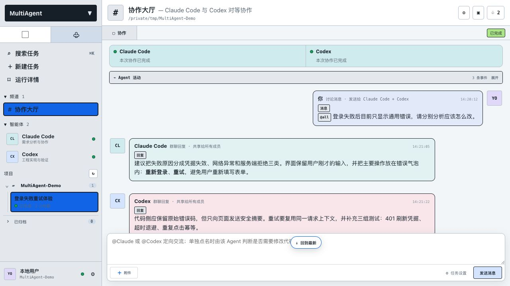
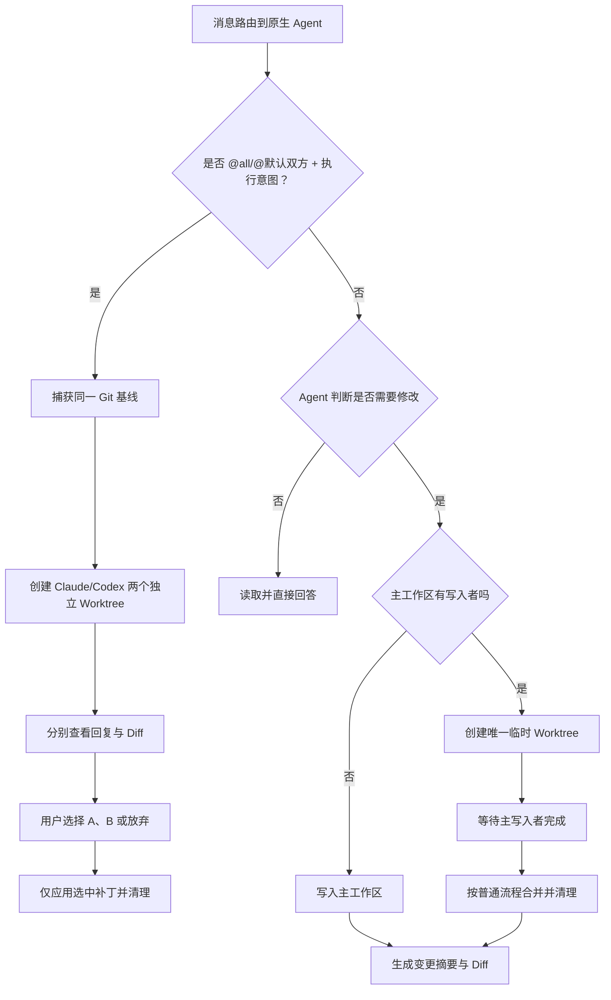
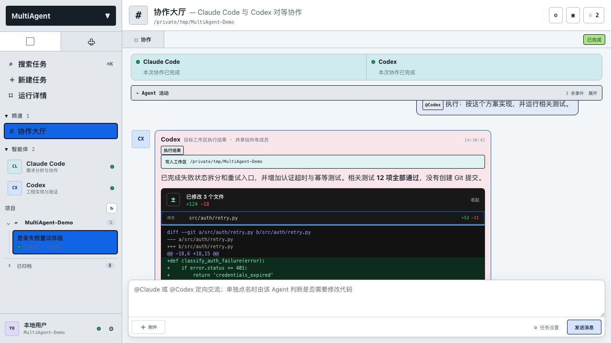
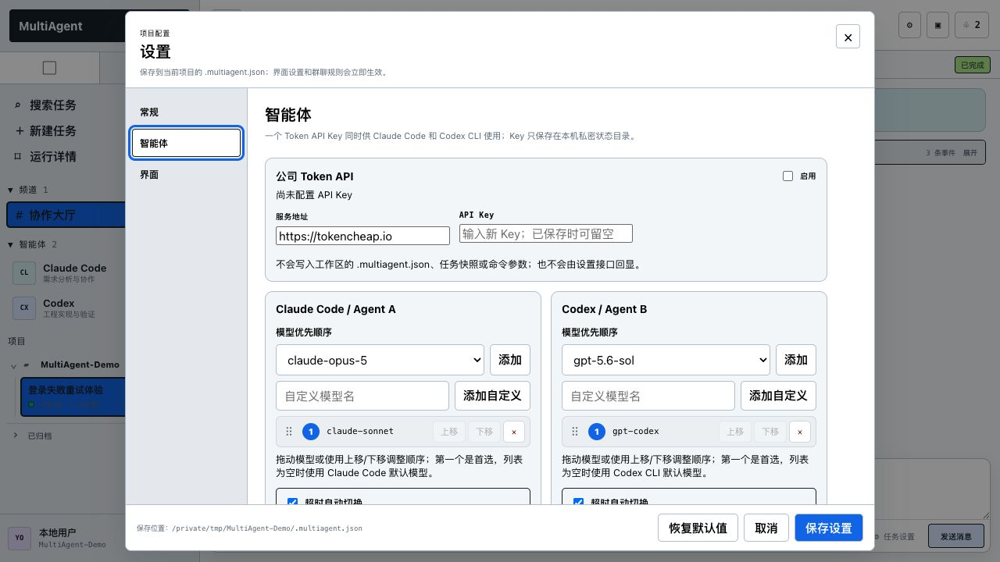
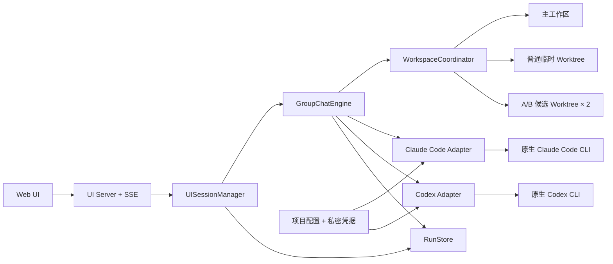

# MultiAgent

MultiAgent 是 Claude Code 与 Codex CLI 的本地群聊协作工作台。它让两个原生编码 Agent 在同一条持久对话中共享上下文，同时保留各自独立的 CLI 会话、工具能力和权限边界。

产品目前只保留一种工作方式：**群聊协作**。打开页面后可以直接讨论、点名某个 Agent 执行，或者让双方并行分析，不需要预先填写目标与需求。



> 截图使用隔离的演示工作区和虚构任务数据，不包含真实项目、任务记录或 API Key。

## 能做什么

- 使用 `@Claude`、`@Codex` 或 `@all` 决定本轮由谁回复。
- Claude Code 与 Codex 共享可见群聊记录，并使用各自独立的原生调用；Claude Code 可复用原生会话，Codex 默认使用不会写入客户端历史的临时线程。
- 一个 Agent 回复期间，用户仍可继续询问另一个 Agent；同一个 Agent 不会并发处理两条互相冲突的消息。
- MultiAgent 不预判读写模式；Claude Code 与 Codex 根据用户请求和各自原生规则自行决定是否修改代码。
- 普通 Git 工作区并发写入时，另一位 Agent 使用唯一临时 Worktree，完成后按现有流程合并并清理；明确的双 Agent 同任务执行则进入下方 A/B 对比流程，非 Git 目录保持原生非阻塞访问。
- 当明确同时要求双方执行同一任务（例如 `@all 执行：分别修复这个问题` 或 `/exec ...`）时，进入 A/B 对比执行：双方从同一 Git 快照创建独立 Worktree，完成后先查看回复和 Diff，由用户选择方案后才写入主工作区。
- 页面展示公开的工具调用、命令、文件操作、测试结果和安全摘要，不采集或展示模型隐藏思维链。
- 每次代码修改显示文件数、增删行、逐文件列表和 Diff 预览，不自动创建 Git 提交。
- 支持图片粘贴与灯箱预览、文档附件、消息编辑重发、重新生成、继续回复、草稿保存、搜索、未读角标和浏览器通知。
- Agent 回复默认加入双方共同上下文，也可以从消息工具栏手动排除或重新加入。
- Claude Code 或 Codex 请求命令审批、网络或工作区外访问、补充信息时，页面弹出统一交互窗口，只暂停发起请求的 Agent。工作区内的文件编辑不再由 MultiAgent 单独拦截。
- 公司 Token API 可用一个 API Key 为两个 CLI 提供模型，并按用户设置的优先顺序在超时后切换。

## 环境要求

支持以下目标平台：

| 平台 | 版本 |
| --- | --- |
| macOS | Intel / Apple Silicon |
| Linux | x86_64 / ARM64 |
| Windows | Windows 10/11，PowerShell 或 CMD |

基础要求：

- Python 3.9 或更高版本。
- Git。非 Git 工作区仍可使用，但 Worktree 和完整 Diff 能力受限。
- Claude Code 与 Codex CLI。安装器可以检测并按需安装，账号登录仍需用户完成。

## 一键安装

先下载或克隆仓库，然后在仓库根目录执行。

### macOS / Linux

只安装 MultiAgent，并检测 Agent CLI：

```bash
./install.sh
```

同时安装缺失的 Claude Code 和 Codex CLI：

```bash
./install.sh --install-agents
```

### Windows PowerShell

只安装 MultiAgent：

```powershell
powershell -ExecutionPolicy Bypass -File .\install.ps1
```

同时安装缺失的 Agent CLI：

```powershell
powershell -ExecutionPolicy Bypass -File .\install.ps1 -InstallAgents
```

安装器的行为：

1. 检查 Python 版本。
2. 将 MultiAgent 复制到独立的用户安装目录并创建隔离环境；安装 MultiAgent 本身不需要联网。
3. 创建唯一的 `multiagent` 命令并配置用户 PATH。
4. 检测 `claude` 和 `codex`；只有传入安装 Agent 的选项时，才通过 npm 安装缺失的官方 CLI。
5. 不自动使用 `sudo`，不提升管理员权限，也不读取或代填账号凭据。

默认安装位置：

| 平台 | 程序目录 | 命令目录 |
| --- | --- | --- |
| macOS / Linux | `~/.local/share/multiagent` | `~/.local/bin` |
| Windows | `%LOCALAPPDATA%\MultiAgent` | `%LOCALAPPDATA%\MultiAgent\bin` |

安装完成后可以移动或删除下载的源码目录。若不希望脚本修改 PATH，使用 `./install.sh --no-path` 或 `install.ps1 -NoPath`。

自动安装 Agent 需要 Node.js 与 npm。CLI 安装完成后，分别运行以下命令并按官方流程完成登录或授权：

```bash
claude
codex
```

### 手动安装

开发环境也可以直接进行可编辑安装：

```bash
python3 -m pip install -e /path/to/multiagent
```

没有安装命令入口时，可以从源码运行：

```bash
python3 -m multiagent_cli -C /path/to/your-project
```

## 启动

进入要处理的项目目录并运行：

```bash
cd /path/to/your-project
multiagent
```

浏览器会打开本地 Web 工作台，启动命令所在目录会成为默认工作区。若已有 UI 服务，新的 `multiagent` 命令会复用服务并切换到当前工作区。

也可以明确指定工作区：

```bash
multiagent -C /path/to/your-project
```

| 参数 | 说明 |
| --- | --- |
| `-C, --workspace PATH` | 指定默认工作区；未指定时优先使用当前项目目录 |
| `--port PORT` | 指定回环端口；默认 `8765`，未显式指定且端口占用时会尝试临近端口 |
| `--no-open` | 启动服务但不自动打开浏览器 |

macOS 也可以双击 `bin/MultiAgent Web.command`，Windows 可以运行 `bin/multiagent-web.pyw`。

## 群聊协作

输入 `@` 会立即显示成员菜单。Enter 发送，Shift+Enter 换行。

```text
@Claude 分析这个错误，先不要修改代码
@Codex 检查当前实现和测试覆盖
@all 分别给出建议
@Claude 执行：修复问题并运行测试
/exec @Codex 实现选定方案
```

### 路由规则

| 写法 | 响应者 | 读写决策 |
| --- | --- | --- |
| `@Claude ...` | Claude Code | Claude Code 原生判断 |
| `@Codex ...` | Codex | Codex 原生判断 |
| `@all ...` | 双方 | 双方各自原生判断 |
| 未点名 | 设置中选择的一方或双方 | 响应者各自原生判断 |
| `执行：` / `/exec` | 一方或双方 | 表达明确执行意图，不改变权限模式 |

Agent 回复按原用户消息归组。即使另一条提问先发出，较早问题的回复也会显示在其对应消息之后。响应超时或执行失败不会删除气泡，而是保留对应 Agent 的失败消息和原因。

### 非阻塞回复

MultiAgent 按 Agent 占用状态调度：

- Claude Code 正在回复时，仍可向 Codex 发送新消息。
- Codex 正在回复时，仍可向 Claude Code 发送新消息。
- 同一个 Agent 尚未完成上一轮时，不会再启动一条并发会话，避免原生上下文交错。
- 双方都空闲时，`@all` 会并行调用两者。

Claude Code 保留自己的原生会话 ID；Codex 默认使用临时线程，不把 MultiAgent 对话写入 ChatGPT/Codex 客户端历史。跨轮共同上下文由 MultiAgent 群聊记录提供，不依赖 Codex 原生 session resume。

## 写入、Worktree 与变更审查

每个被路由到的 Agent 都以原生工作区能力启动，由 Agent 自己根据用户请求决定只读分析还是修改文件。`执行：` 和 `/exec` 仍可表达明确的执行意图，但不再承担权限开关作用。

### 双 Agent A/B 对比执行

只有在同一条消息明确同时命中 Claude 和 Codex，并且带有 `执行：`、`/exec` 或 `/run` 执行意图时，才启用 A/B 隔离流程。系统会先验证当前目录是有初始提交的 Git 仓库，再从同一个基线创建两个 detached Worktree；两个 Agent 执行期间主工作区保持不变，也不会自动合并。

两个候选完成后，状态变为“待选择”。页面分别展示最终回复、文件差异、Worktree 路径和通用查看命令；命令只复制给用户，不会由 WebUI 自动执行。用户选择采用某个候选后，系统会重新校验主工作区仍与基线一致，安全应用选中候选的补丁并清理两个 Worktree；主工作区若已发生变化，则阻止应用并保留恢复补丁。用户也可以直接放弃全部候选，主工作区不会被修改。

页面还提供“在主工作区预览”按钮。它会把某个候选的完整补丁临时应用到主工作区，切换到另一个候选时先恢复共同基线，再应用另一套补丁，因此同一时刻只有一个候选在主工作区生效。预览不会提交 Git；确认后点击“采用”才会结束对比并清理候选 Worktree，点击“放弃全部”则恢复预览前状态。这里不把另一套任意源码强行改写成注释，因为二进制、删除文件、配置和不同语言语法都无法安全地通用注释。

当前目录不是可用 Git 仓库时，不进入 A/B 模式，并提示初始化 Git 或改用单 Agent 执行。普通讨论、单 Agent 执行以及没有明确执行意图的 `@all` 仍沿用下面的普通 Worktree 协调流程。



Worktree 协调器不会自动提交 Git。临时 Worktree 完成后，修改会回到主工作区并以未提交变更存在；发生无法安全合并的冲突时会保留错误和恢复信息，不会静默覆盖文件。

非 Git 工作区没有可用的 Worktree 与补丁合并机制。为保持两个原生 Agent 的独立非阻塞会话，它们会共享目标目录；若同时决定修改同一文件，结果取决于各自原生行为，因此需要用户自行避免冲突。

### 变更面板

每条执行回复可以携带：

- 修改文件总数。
- 新增与删除行数。
- 每个文件的状态和行数统计。
- 可折叠的逐行 Diff。
- 非 Git 工作区或二进制文件无法预览时的明确说明。



## Agent 活动与原生交互

页面顶部的“Agent 活动”区域记录可以安全公开的过程信息：

- 搜索和读取的目标。
- 工具名称与工具状态。
- 执行命令及其结果摘要。
- 文件修改和测试验证。
- 等待授权、失败、超时或完成状态。

“实时回复预览”只显示提供方公开返回的文本增量，不包含隐藏思维链。命令输出、路径和工具参数经过单独的安全摘要通道，常见 API Key、Token 和密码会被遮盖。

当原生 CLI 请求执行命令、修改文件、扩展沙箱权限或询问用户时，Web UI 会打开统一的交互对话框：

1. 发起请求的 Agent 暂停等待。
2. 页面展示请求来源、命令、工作目录或问题选项。
3. 用户批准、拒绝或回答后，仅恢复对应 Agent。
4. 另一位 Agent 可以继续读取、回复或处理独立任务。

所有轮次都允许发起原生权限申请；Agent 在用户批准前仍受自身原生审批规则约束。后台任务发起请求时，页面会自动切换到对应任务并打开交互对话框。

## 消息与附件

- 发送消息后立即显示用户气泡，并为目标 Agent 创建加载气泡。
- 支持编辑历史用户消息并作为新尝试重新发送，不覆盖审计记录。
- Agent 回复可以重新生成或继续生成；“重试”会删除旧回复并用新回复替代，“继续”则保留原回复。
- 每条 Agent 回复默认进入后续共同上下文；点击回复工具栏中的“上下文”可排除，再次点击可恢复。切换后下一轮会重建原生会话上下文。
- 每个任务独立保存输入草稿，刷新或切换任务不会丢失。
- 后台完成、失败或等待权限时可以显示浏览器通知和未读角标。
- 输入框支持点击、拖放和粘贴图片；图片先显示缩略图，发送后可以在当前页面放大预览。
- 文档附件按消息注入 Agent 上下文，上传文件会镜像到工作区 `.multiagent/attachments/<run-id>/`。
- SVG 不在图片上传白名单内，下载接口会校验扩展名、记录归属和路径穿越。

## 设置、模型与 Token API

设置分为三部分：

- **常规**：工作区、未点名响应者、Agent 自主写入规则。
- **智能体**：Token API、模型优先顺序、超时切换、CLI 命令和群聊身份。
- **界面**：主题、紧凑侧栏、归档显示、实时回复预览和浏览器通知。



主题和界面开关会立即应用并独立保存；“恢复默认值”也会按相同规则立即更新。模型列表支持拖动或上移/下移，首项优先；某个模型响应超时时，可以按顺序切换到下一项。

### Token API Key

公司 Token API 的一个 Key 可以同时提供给 Claude Code 与 Codex。用户在“设置 → 智能体”中输入 Key，完整值只保存在本机私密状态目录：

- 不写入工作区 `.multiagent.json`。
- 不写入任务快照。
- 不放入命令行参数。
- 不通过设置接口回显；页面只显示配置状态和末四位。
- 启动 Agent 子进程时通过环境变量注入。

兼容的环境变量名为 `MULTIAGENT_TOKEN_API_KEY` 和旧版 `TOKENCHEAP_API_KEY`；新配置统一保存为一份凭据。

## 项目配置

项目配置默认为工作区根目录的 `.multiagent.json`，也可以通过 `MULTIAGENT_CONFIG` 指定。最小示例：

```json
{
  "group_chat_default_agent": "both",
  "context_compaction": {
    "enabled": true,
    "threshold_tokens": 16000,
    "target_tokens": 8000,
    "recent_messages": 8
  },
  "ui": {
    "theme": "paper",
    "show_archived": false,
    "compact_sidebar": false,
    "stream_model_text": false,
    "browser_notifications": false
  },
  "token_api": {
    "enabled": false,
    "base_url": "https://tokencheap.io"
  },
  "claude": {
    "models": [],
    "fallback_on_timeout": true,
    "timeout": 900,
    "extra_args": []
  },
  "codex": {
    "models": [],
    "fallback_on_timeout": true,
    "timeout": 900,
    "extra_args": []
  }
}
```

| 字段 | 说明 |
| --- | --- |
| `group_chat_default_agent` | 未点名消息的响应者：`both`、`claude` 或 `codex` |
| `worktree` | 是否为并发写入创建 Git 隔离 Worktree；关闭后写入 Agent 按顺序使用主工作区，避免重叠修改合并冲突 |
| `group_chat_identities` | 两个 Agent 可编辑的群聊身份；固定路由规则由程序附加 |
| `context_compaction` | 共同上下文压缩开关、触发预算、目标预算和最近原文消息数 |
| `ui.theme` | `paper`、`ocean`、`graphite` 或 `botanical` |
| `ui.stream_model_text` | 是否显示提供方公开的回复增量 |
| `token_api` | 公司 Token API 的启用状态和服务地址，不包含完整 Key |
| `claude.models` / `codex.models` | 有序模型列表；为空时使用原生 CLI 默认模型 |
| `fallback_on_timeout` | 超时或检测到原生协议不兼容后，是否尝试列表中的下一模型 |
| `timeout` | 单个模型调用的连续无活动超时秒数；审批等待不会消耗 Claude 的计时 |

Codex 在网页审批模式下通过 `app-server` 运行。`codex.extra_args` 在该模式中支持
`-c/--config`、`--enable`、`--disable` 和 `--strict-config`；其他仅属于
`codex exec` 的参数会返回明确配置错误，不会被静默忽略。

MultiAgent 创建的 Codex 线程默认使用临时模式，不写入 Codex 原生会话历史，
因此不会出现在 ChatGPT/Codex 客户端中。跨轮上下文由 MultiAgent 自己的群聊记录
提供，不依赖原生 Codex session resume。

Agent 的共同上下文或原生续接会话累计用量超过 `context_compaction.threshold_tokens`
的本地估算值后，MultiAgent 会把较早消息整理成带消息 ID 的提取式摘要，并保留最近消息原文，将新会话上下文控制在
`target_tokens` 附近。无原生续接会话的 Agent 每轮直接使用该投影；Claude 等支持原生续接的 Agent 会在达到预算后自动开启新会话承接压缩上下文。完整消息仍保存在任务记录中；压缩不额外调用模型。排除回复、删除
旧回复或重试导致历史变化时，摘要检查点和原生会话都会失效并在下一轮重新生成。

Windows 中包含空格的 CLI 路径建议使用字符串数组：

```json
{
  "claude": {
    "command": ["C:\\Program Files\\Claude\\claude.exe"]
  }
}
```

## 数据位置与安全边界

任务记录默认保存在：

```text
macOS / Linux: ~/.local/state/multiagent/runs/
Windows:       %LOCALAPPDATA%\multiagent\runs\
```

上传原件保存在状态目录的 `_attachments/<run-id>/`。工作区镜像位于 `.multiagent/attachments/<run-id>/`，该目录已被项目 `.gitignore` 忽略。

Web 服务只监听 `127.0.0.1`：

- 写请求要求同源。
- 页面设置 CSP 与 `X-Content-Type-Options`。
- 附件接口校验任务记录、文件名和解析后的真实路径。
- 可渲染图片类型使用服务器白名单决定，不信任上传者声明的 Content-Type。
- API Key 不进入浏览器响应、任务数据或工作区配置。

## 项目架构



| 模块 | 职责 |
| --- | --- |
| `multiagent_cli/web_launcher.py` | 唯一 `multiagent` 入口、工作区解析、端口复用和浏览器启动 |
| `multiagent_cli/ui_server.py` | 本地 HTTP/SSE、会话状态、附件、设置和原生交互请求 |
| `multiagent_cli/group_chat.py` | 消息路由、共享上下文、并发 Agent 和回复持久化 |
| `multiagent_cli/workspace_coordinator.py` | 主工作区租约、普通临时 Worktree、A/B 候选 Worktree、补丁应用和清理 |
| `multiagent_cli/adapters.py` | 原生 CLI 事件解析、超时、模型切换、活动摘要和权限请求 |
| `multiagent_cli/runtime.py` | Web 会话共用的适配器构建、任务快照与恢复 |
| `multiagent_cli/run_store.py` | 任务记录、归档、重命名和附件索引 |
| `multiagent_cli/token_api.py` | 模型目录、路由配置和私密凭据 |
| `multiagent_cli/web/` | 消息流、Diff、活动卡片、设置与视觉主题 |

技术上较关键的部分是：在保留两个原生 CLI 独立会话的前提下共享群聊上下文；按 Agent 粒度实现非阻塞调度；通过主工作区租约和临时 Worktree 协调 Git 工作区并发写入；把不同提供方的审批与提问统一成可恢复的 Web 交互协议。

## 开发与测试

```bash
python3 -m unittest discover -s tests -v
node --check multiagent_cli/web/app.js
python3 -m compileall -q multiagent_cli
```

测试覆盖群聊路由、共享上下文、非阻塞回复、原生读写决策与 Worktree、超时失败气泡、原生交互、附件安全、图片粘贴、活动摘要、实时回复设置、任务持久化、主题即时应用、工作区选择和 HTTP 路由。

## 当前限制

- 自动安装只能安装 Claude Code 和 Codex CLI 程序，不能代替用户完成账号登录、浏览器授权或企业认证。
- Worktree 合并依赖可用的 Git 工作区；普通目录仍可读写，但没有完整的 Git Diff 和并发隔离能力。
- Web UI 需要一个本机回环端口。未显式指定端口时会自动寻找临近空闲端口，显式端口冲突仍会报错。
- Windows 安装与界面建议在真实 Windows 10/11 环境继续做发布前验证。
