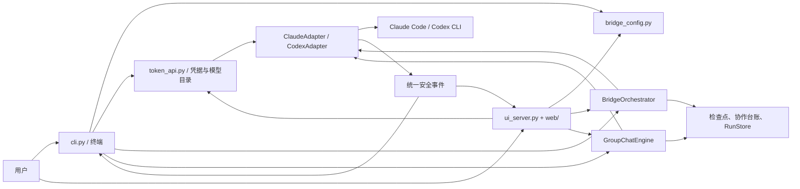

# MultiAgent Bridge

在同一个终端或本地 Web 工作台里，让 Claude Code 与 Codex CLI 以两种预设方式协作：通过独立提案、交叉审核和统一方案完成“共识实施”，或进入支持 `@Agent` 动态路由、单写入者执行与共享上下文的持久群聊。

项目名：`multiagent` · 当前版本：`2.5.0` · Python：`>= 3.9` · Python 包依赖：无

> MultiAgent 是原生 CLI 的编排层，不会绕过 Claude Code 与 Codex CLI 自己的文件工具和沙箱。可选的公司 Token API 配置只负责把同一凭据和网关参数安全注入两套 CLI。

> `2.0.0` 删除了 1.x 的主从角色兼容层。共识实施身份使用 `identities.agent_a/agent_b`，群聊身份使用 `group_chat_identities.agent_a/agent_b`，命令行只使用 `--executor`。1.x 检查点不会被 2.0 续跑，应新建任务。

## 目录

- [项目定位](#项目定位)
- [快速开始](#快速开始)
- [首次使用与公司内分发](#首次使用与公司内分发)
- [平台支持](#平台支持)
- [本地 Web UI](#本地-web-ui)
- [协作流程](#协作流程)
- [常用运行模式](#常用运行模式)
- [命令参考](#命令参考)
- [配置](#配置)
- [证据化共识与共享任务板](#证据化共识与共享任务板)
- [单写入者执行](#单写入者执行)
- [断点恢复与运行记录](#断点恢复与运行记录)
- [终端界面与输出](#终端界面与输出)
- [质量评测](#质量评测)
- [权限与安全](#权限与安全)
- [项目结构](#项目结构)
- [开发与测试](#开发与测试)
- [限制与故障排查](#限制与故障排查)

## 项目定位

MultiAgent 解决的是“两个成熟编码 Agent 如何围绕同一项需求形成闭环”，而不是重新实现一个编码 Agent。

它提供以下能力：

- 并行调用 Claude Code（Agent A）和 Codex CLI（Agent B）独立提出完整方案，双方完成前互不可见，减少锚定和迎合。
- 并行执行双向交叉审核，让每一方都能检查并反馈另一方方案。
- 由临时整合者生成统一方案；共识模式下，审核者在下一轮接棒整合，双方轮换沟通。
- 将统一方案版本、双方批准摘要、争议、需求覆盖和证据保存为结构化状态。
- 用户确认方案后才进入写入阶段；也可在自动化环境中显式跳过确认。
- 独立运行配置好的测试、lint、类型检查或构建命令，并把真实结果交给另一位对等 Agent 验收。
- 保存阶段检查点，并从最后一个完整成功阶段恢复；写入阶段由一个 Agent 直接修改目标工作区。
- 汇总历史完成率、验收率、验证率、问题严重级别、耗时和 Token。
- 提供持久群聊：未点名时双方并行回答，点名时只有目标 Agent 回答；显式要求执行时，指定 Agent 独占目标工作区写权限，所有消息仍会进入双方后续上下文。

它当前不是：

- 任意数量、任意厂商 Agent 的通用框架；当前两个预设模式固定桥接 Claude Code 与 Codex CLI。
- 让两个 Agent 同时修改同一工作区的系统；共识实施写入阶段串行，群聊 `@all 执行` 会在写入前被拒绝。
- 自动提交或合并器；工作区结果仍由用户检查和提交。
- 通用云端密钥托管器；只有显式启用的公司 Token API Key 会保存在本机私密状态目录，其他认证仍由原生 CLI 管理。

## 快速开始

### 1. 准备环境

需要：

- Python 3.9 或更高版本。
- 已安装并完成认证的 Claude Code 命令 `claude`。
- 已安装并完成认证的 Codex CLI 命令 `codex`。
- Git（建议安装，用于工作区指纹和差异检查；直接写入任务不要求工作区干净）。

MultiAgent 优先从 `PATH` 查找命令，也会检查这些常见位置：

- Claude Code：`~/.local/bin/claude`
- Codex CLI：`~/Applications/ChatGPT.app/Contents/Resources/codex`
- Codex CLI：`/Applications/ChatGPT.app/Contents/Resources/codex`

找不到时可以在配置中显式填写可执行文件路径。

### 2. 安装命令

推荐通过 Python 包入口安装，它会在当前 Python 环境注册唯一的 `multiagent` 命令：

```bash
python3 -m pip install -e /path/to/multiagent
```

项目只注册一个启动命令：

```text
multiagent    唯一启动命令
```

macOS/Linux 开发环境也可以使用仓库中的 POSIX 启动器 `bin/multiagent`，并将它链接到用户命令目录：

```bash
mkdir -p ~/.local/bin
ln -s /path/to/multiagent/bin/multiagent ~/.local/bin/multiagent
```

Windows 源码开发环境可以使用对应的批处理启动器：

```powershell
bin\multiagent.cmd --version
```

`bin/multiagent` 使用 `/bin/sh` 和 `/usr/bin/python3`，仅用于 POSIX；`bin\multiagent.cmd` 会优先使用 Windows Python Launcher。正式安装仍应优先使用 `pip` 生成的跨平台 `multiagent` 命令入口。

### 3. 首次使用检查

先进行不调用模型的快速检查：

```bash
multiagent --check
```

再检查 CLI、认证、工作区、状态目录和模型配置：

```bash
multiagent doctor
```

`doctor` 默认不发起模型请求。只有显式增加下面的参数才会分别发送一次最小探测请求：

```bash
multiagent doctor --probe-models
```

建议先分别确认原生 `claude` 和 `codex` 命令自身能够工作，再运行 MultiAgent。`doctor` 可以定位 CLI 缺失、认证失败和模型通道问题，但不会替代原生 CLI 的登录或网关配置。

### 4. 在任意项目中运行

```bash
cd /path/to/your-project
multiagent "修复当前失败的测试，并审查改动"
```

默认会在实施前请求人工确认方案。脚本、管道或其他非交互环境必须显式允许自动确认：

```bash
multiagent --yes "修复当前失败的测试，并审查改动"
```

不提供任务时进入统一交互终端：

```bash
multiagent
```

安装后会同时生成无终端 Web 启动入口。可以从桌面快捷方式或文件管理器启动 `multiagent-web`，它会启动本地服务并自动打开浏览器；重复启动只会打开已有页面。

```text
Windows 安装环境：双击 .venv\Scripts\multiagent-web.exe
Windows 源码环境：双击 bin\multiagent-web.pyw
macOS 源码环境：双击 bin/MultiAgent Web.command
```

`multiagent ui` 仍保留给需要查看服务日志、指定端口或进行故障排查的终端用户。

## 首次使用与公司内分发

MultiAgent 的 Web 设置支持公司 Token API：员工只填写一次 Key，运行时分别通过 `ANTHROPIC_AUTH_TOKEN` 和 `OPENAI_API_KEY` 注入 Claude Code 与 Codex CLI。Key 保存在 MultiAgent 私有状态目录的 `_credentials/token_api.json`，不会写入项目配置、任务快照、命令参数或设置接口响应。也可以在启动 MultiAgent 前设置 `MULTIAGENT_TOKEN_API_KEY`；兼容别名 `TOKENCHEAP_API_KEY` 仍可读取，但优先级较低。环境变量优先于私密文件，未启用该功能时两套 CLI 继续使用各自已有的认证。

建议公司统一分发：

- 固定版本的 MultiAgent、Claude Code 与 Codex CLI。
- 不含密钥的网关地址、模型名称和原生 CLI 配置模板。
- 不含密钥的全局 `~/.config/multiagent/config.json`，或各项目 `.multiagent.json`。
- 团队统一的 Agent 身份、审核轮次、单写入者策略和 `verification.commands`。

每位使用者只负责：

- 在“设置 → 智能体”填写公司 Token API Key，或继续使用两套 CLI 原有登录方式。
- 确认自己对目标项目和 MultiAgent 状态目录有读写权限。
- 首次运行一次真实模型探测，确认自己的 Key 对配置模型确实有可用通道。

首次使用按下面的顺序即可完成引导：

```bash
# 1. 确认安装和原生 CLI 路径，不调用模型
multiagent --check

# 2. 可选：仅在项目需要覆盖公司默认值时生成项目配置
multiagent -C /path/to/project init

# 3. 检查 CLI、认证、状态目录和工作区，不调用模型
multiagent -C /path/to/project doctor

# 4. 经用户确认后，各发起一次最小模型请求
multiagent -C /path/to/project doctor --probe-models

# 5. 开始使用；日常可改为从桌面打开 multiagent-web
multiagent -C /path/to/project ui
```

`multiagent doctor` 必须始终可以独立重跑，不能把诊断能力只放在一次性向导里。

## 平台支持

当前仍不能笼统宣称“完全跨平台”。核心编排使用 Python 标准库；Python 包入口、源码启动器、状态/配置目录、Git 未跟踪文件 diff 和进程终止逻辑均已增加 Windows 分支，但 Windows 原生尚待实机完成整套验收。

| 平台 | 当前支持级别 | 说明 |
| --- | --- | --- |
| macOS | 正式支持 | 当前主要开发和完整测试平台；源码环境可双击 `bin/MultiAgent Web.command` 打开 Web 工作台。 |
| Linux | 实验性支持 | 已纳入 Python 3.9/3.13 单元测试矩阵，核心逻辑和 POSIX 启动器预期可用；真实 Claude Code/Codex、浏览器和发行包仍待独立验收。 |
| Windows 原生 | 预览、待实机验证 | 已纳入 Python 3.9/3.13 单元测试矩阵；安装后可双击 `multiagent-web.exe`，源码环境可双击 `bin\multiagent-web.pyw`，真实 Claude Code/Codex、停止与 Web UI 仍待实机验收。 |
| WSL | 实验性支持 | 按 Linux 环境运行，仍取决于 Claude Code、Codex CLI、Git 和浏览器的实际安装状态。 |

对外发布时建议写“正式支持 macOS，Linux/WSL 为实验性支持，Windows 原生为预览支持”。只有 Windows CI 和下文实机清单均通过后，才能把 Windows 升级为正式支持。

## 本地 Web UI

日常使用不再要求先打开终端。`pip install` 会生成 GUI 入口 `multiagent-web`；Windows 下它是无控制台的 `multiagent-web.exe`。源码仓库同时提供 macOS `.command` 和 Windows `.pyw` 双击启动器。启动器会检查 `127.0.0.1:8765`：已有 MultiAgent 服务时直接打开页面；若端口被其他程序占用，则自动选择后续可用端口；否则在后台启动服务并打开浏览器。默认工作区依次取显式的 `MULTIAGENT_WORKSPACE`、当前项目、最近一次任务的工作区和当前目录。

页面按 Slark 的频道式工作台重组：暖黄色项目侧栏、“协作大厅”、`协作 / 任务` 页签、消息流、底部输入框，以及按需打开的详情/智能体右侧栏。底层仍调用 MultiAgent 原有的 Python 编排器，不会切换到 Slark 的 SQLite、Channel 或 Agent Engine。

服务本身允许本机浏览器访问 localhost。浏览器是否自动打开、以及外部自动化工具能否控制 localhost，由运行 MultiAgent 的操作系统、浏览器和宿主应用安全策略决定，不是 `.multiagent.json` 可以改变的权限。

不要直接双击 `multiagent_cli/web/index.html`：它只是随安装包分发的静态资源，不能从浏览器安全沙箱里启动本机 Python 后端。应双击上述桌面启动器；若误打开静态文件，页面会提供默认端口的重新连接入口。

```bash
# GUI/桌面入口；重复运行会复用已有服务
multiagent-web

# 在当前目录打开 UI
multiagent ui

# 指定默认工作区和端口
multiagent --workspace /path/to/project --port 9000 ui

# 只启动服务，不自动打开浏览器
multiagent --no-open ui
```

从终端运行 `multiagent ui` 时，未显式传入 `-C/--workspace` 就以执行命令时的当前目录作为默认工作区。即使复用了已经运行的 UI 服务，也会先把该服务切换到本次命令所在目录；`-C /path/to/project` 始终可以显式覆盖这一默认值。

服务可在“设置 → 界面 → 本地 Web 服务”中关闭。有任务正在运行时后端会拒绝关闭；应先停止任务并等待状态结束。任务记录和检查点不会随服务关闭而删除。

界面包含：

- 集中式“设置”面板：工作区既可直接输入，也可通过内置目录浏览器选择；切换协作模式时只展示实际生效的选项。界面页提供协作纸张、深海终端、石墨专业和植物工作室四套主题；主题、默认展开已归档和紧凑侧栏在切换后立即应用，并独立保存到当前工作区 `.multiagent.json`，无需再点击“保存设置”。“恢复默认值”会立即保存这三项界面默认值，其他表单项只恢复为默认草稿，点击“保存设置”后才生效。共识实施可配置执行协调者、方案/共识/人工门禁、审核轮次和确定性验证；群聊可配置未点名时的默认响应者及是否允许执行指令。任务流程配置只影响之后启动的任务。
- 左侧任务按工作区分组，项目标题只显示文件夹名；任务标题会去掉已知工作区路径前缀，避免重复展示长路径。
- 右键任务可打开对话、重命名、停止运行、从检查点恢复、复制任务 ID、复制项目路径或归档；重命名只改变界面标题，不改变原始需求和群聊上下文。归档记录集中在可折叠的“已归档”区域，可随时取消归档，也可永久删除任务、检查点和关联上传文档。运行中或未归档的任务不能删除。
- “协作大厅”消息流；共识实施会展示独立方案、交叉审核、统一方案、执行结果和验收，群聊会按时间展示每条用户消息和双方回复。写入完成后会附带本次执行修改的文件数、增删行统计和可展开的逐文件 diff；统计使用临时 Git 索引，不改变暂存区，也不创建 worktree。
- 与 Slark 相同心智的“协作 / 任务”双页签，以及四列共享任务看板。
- 按需打开的运行概览、事件时间线、证据争议和智能体资料右侧栏。
- 底部消息输入框与独立的新任务弹窗；新建时可选择“共识实施”或“群聊协作”。共识实施必须先填写目标与需求；群聊可以不填写第一条消息，先创建空对话，再从底部输入框开始讨论。输入 `@` 会立即弹出 Claude Code、Codex 和所有成员选项；`Enter` 发送，`Shift+Enter` 换行。消息提交后先立即显示右侧用户气泡，并在左侧为目标 Agent 显示加载气泡，服务端确认后再由真实回复替换；用户、Claude Code、Codex 和系统消息使用不同背景色。群聊支持 `@Claude`、`@Codex`、`@all`，也支持用“执行：”或 `/exec` 把本轮切换为指定 Agent 直接写入目标工作区；新任务支持上传常见文档，最多 5 个、单个 10 MB、合计 20 MB。
- 宽 Markdown 表格使用消息内部横向滚动，不会压缩整个页面。
- 与终端一致的执行、整体修订、定向要求、Markdown 导出和取消操作。
- 运行中可从顶部“停止”按钮或对话右键菜单单独中断当前任务；Claude Code、Codex 及验证进程会被终止，已完成步骤和精确检查点会保留，之后可恢复。

网页通过同源 REST 提交操作，通过 Server-Sent Events 接收安全状态更新。只有 `safe_summary`、阶段、检查点和最终产物会发送给页面；思考文本、具体命令和 API Key 不会进入浏览器。服务固定监听本机回环地址，并拒绝非同源写请求。

上传文档保存在 MultiAgent 私有状态目录的 `_attachments/<任务 ID>/` 下，不写入目标项目。Agent 收到的是这些文件的只读绝对路径；永久删除已归档任务时会同步清理其上传文档。

设置面板不会回显完整 API Key，只返回是否已配置和末四位。公司 Token API Key 独立保存在本机私密状态目录，项目 `.multiagent.json` 只保存启用状态、服务地址和模型顺序。保存设置时会检查配置文件是否被其他程序修改，避免覆盖外部编辑；未知扩展字段会原样保留。

前端资源已经预构建并随 Python 包分发，最终用户不需要安装 Node.js。视觉 token、频道 Shell 和部分交互语言参考并改编自 MIT 许可的 [coppynight/slark](https://github.com/coppynight/slark)；版权与许可证保留在 [THIRD_PARTY_NOTICES.md](THIRD_PARTY_NOTICES.md) 和侧栏底部的齿轮链接中。

## 协作流程

### 模式一：共识实施（`workflow`）

Claude Code 固定显示为 Agent A，Codex 固定显示为 Agent B；两者拥有相同的提案、质疑和否决权。默认由 Claude Code 临时担任执行协调者，使用 `--executor codex` 可以把实施阶段写权限交给 Codex。执行协调者只是当前写权限持有者，不拥有更高的方案决策权。

```text
1. 捕获任务开始前的 Git / 文件状态
2. Agent A 与 Agent B 在互不可见的情况下，并行独立提出完整方案
3. 双方交换方案，并行完成 A→B、B→A 两份交叉审核
4. 临时整合者结合两份方案和两份审核生成统一方案
5. [可选] 另一方审核统一方案；如不接受，它在下一轮接棒整合，由对方审核，直到共同批准同一版本或达到审核上限
6. [默认] 用户批准、要求修订或取消统一方案
7. 执行协调 Agent 独占工作区写权限并实施
8. Bridge 直接执行配置好的确定性验证命令
9. 另一位对等 Agent 读取当前工作区，并结合需求、统一方案、基线和验证日志做结构化验收
10. 如需修改，执行协调 Agent 恢复原会话修订，再进入下一轮验收
11. 保存最终状态、质量指标、共享任务板和可恢复检查点
```

第 2 步的两个独立提案回合并行启动；第 3 步的两份交叉审核也并行启动。写入阶段始终串行，两个 Agent 不会同时修改同一工作区。

### 模式二：群聊协作（`group_chat`）

群聊是持久、按消息授权的协作会话，不进入统一方案和代码验收状态机：

1. 用户消息不包含有效 `@` 时，由 `group_chat_default_agent` 决定响应者；默认是 Claude 与 Codex 并行独立回答。
2. `@Claude` 或 `@Codex` 只触发被点名的一方；`@all` 再次广播给双方。
3. 每条用户消息和 Agent 最终回复都会先后写入中央群聊记录。
4. 未被点名的 Agent 不会为了“同步上下文”产生一次隐藏计费调用；它下次被点名或参与广播时，会收到自上次发言后遗漏的全部增量消息，包括另一位 Agent 的回答。
5. 双方同轮并行回答时互相看不到对方尚未完成的当轮答案；下一轮开始前，两份答案都会进入双方上下文。
6. 普通消息始终使用原生 CLI 的只读/plan 权限；`@Claude 如何执行……` 仍然只是讨论，不会修改文件。
7. 开启 `group_chat_execution` 后，`@Claude 执行：……` 或 `/exec @Claude ……` 只授权 Claude 直接写入目标工作区；Codex 同理。关闭后所有执行指令都会被拒绝。
8. `@all 执行：……`、`/exec @all ……` 以及其他同时指定双方执行的请求会在写入前被拒绝；应明确点名唯一写入者。
9. 讨论会话与执行会话分别恢复，所有用户消息和双方回复仍进入同一份共享群聊上下文。

群聊执行不会自动提交；执行结果卡会显示实际写入的目标工作区。Web 服务还会阻止同一工作区同时启动多个任务，避免不同任务越过单写入者约束。

群聊记录可像普通对话一样按项目归类、归档、删除，并能在 Web 服务重启后继续；原生 Claude/Codex 会话 ID、每方已读游标和完整消息记录都会保存。

几个容易混淆的概念：

- **方案共识**发生在写代码之前，默认关闭。它判断双方是否对需求、架构、失败路径、兼容性和测试计划形成了有证据的共同结论。
- **代码审查**发生在实施之后，默认 1 轮。它判断实际实现是否满足需求，并使用真实验证结果作为证据。
- **人工方案门禁**默认开启。即使双方达成共识，仍由用户决定执行、要求修订、导出技术文档或取消。
- **最终审查**默认开启。最后一次代码修订后，对等验收 Agent 会再检查一次，避免以未复核的改动结束。

## 常用运行模式

### 默认：双提案 + 双向交叉审核 + 一轮代码审查

```bash
multiagent "完成任务"
```

### Codex 获得实施写权限，Claude 验收

```bash
multiagent --executor codex "完成任务"
```

### 开启方案自动共识

```bash
multiagent --consensus "完成任务"
```

统一方案未被接受时，当前审核者会在下一轮接棒成为临时整合者，再由另一方审核。最多运行 `max_consensus_rounds` 个审核轮次；走完仍未共同批准同一版本时，任务停止且不进入写入阶段。

### 群聊协作

```bash
# 单轮群聊；未点名时双方都会回答
multiagent --mode group-chat "比较当前两种实现方案"

# 进入连续群聊
multiagent --mode group-chat

# 群聊中按成员路由
@Claude 先给出方案
@Codex 审核 Claude 刚才的回答
@all 根据争议分别给出结论

# 随时把当前消息切换为单 Agent 写入执行
@Claude 执行：按刚才的方案修复并运行测试
/exec @Claude 修复指定问题
```

连续群聊使用 `/help` 查看路由说明，使用 `/exit` 退出。退出不会删除记录，`multiagent resume <run-id>` 可重新进入该群聊。

### 导出最终技术文档

人工方案门禁提供五个操作：

```text
[e] 执行统一方案    [r] 提出整体修订要求
[t] 单独给某个 Agent 提要求
[d] 导出最终技术文档    [c] 取消任务
```

选择 `t` 后再选择 `a`（Agent A / Claude）或 `b`（Agent B / Codex），输入的要求会作为 `instruction` 直接发送给选中的 Agent。该 Agent 使用自己的规划会话独立修订当前完整统一方案；另一位 Agent 不会被冒充为该意见的提出者。启用 `--consensus` 时，修订完成后另一方能看到这条可追溯记录，并按原有证据化共识协议复核。定向修订与整体修订共同计入 `max_plan_revisions`。

选择 `d` 会在当前任务工作区生成：

```text
multiagent-docs/<run-id>-technical-plan.md
```

导出后不会执行代码或退出确认界面，仍可继续选择执行、修订、定向要求或取消。文档包含统一技术方案、双方独立方案、双向交叉审核、用户定向要求、统一方案审核记录、方案版本和批准摘要。

如果因 `max_consensus_rounds` 用尽而退出，MultiAgent 会在退出前自动导出同格式文档，并明确标记“未达成共识”，逐项列出：

- 未通过的需求、架构、失败路径、兼容性或测试维度。
- 未覆盖或缺少证据的需求。
- 未解决争议及其严重级别、原因和证据。
- 双方剩余分歧与尚需完成的修订。
- 哪个 Agent 尚未批准当前方案摘要。

### 调整代码审查轮数

```bash
multiagent --rounds 2 "完成任务"
```

`--rounds 0` 会关闭实施后的常规代码审查，但仍保留双方独立提案、交叉审核和统一方案：

```bash
multiagent --rounds 0 "完成任务"
```

### 单 Agent 模式

```bash
multiagent --no-planning-collaboration --rounds 0 "完成任务"
```

这会跳过双方独立提案、交叉审核和代码验收。它适合低风险任务或对照评测，但不再具备多 Agent 质量门禁。

### 指定工作区和配置

```bash
multiagent -C /path/to/project \
  --config /path/to/bridge.json \
  "完成任务"
```

## 命令参考

### 运行参数

| 参数 | 作用 | 默认值 |
| --- | --- | --- |
| `-C, --workspace PATH` | 指定目标工作区 | 当前目录 |
| `-c, --config PATH` | 显式指定桥接配置 | 自动发现 |
| `--mode workflow\|group-chat` | 选择共识实施或群聊协作 | 配置中的 `collaboration_mode` |
| `--executor claude\|codex` | 选择实施阶段持有写权限的 Agent | `claude` |
| `--rounds N` | 最大代码审查/修订轮数，允许 `0` | `1` |
| `--consensus` | 开启方案自动协商 | 关闭 |
| `--no-consensus` | 覆盖配置并关闭方案自动协商 | — |
| `-y, --yes` | 跳过人工方案确认 | 关闭 |
| `--no-planning-collaboration` | 跳过双方提案和双向交叉审核 | 关闭 |
| `--no-final-review` | 最后一次修订后不追加最终审查 | 关闭 |
| `--tui` / `--no-tui` | 强制启用/禁用固定 TUI | TTY 中自动启用 |
| `--progress` / `--no-progress` | 显示/关闭安全进度状态和等待动画 | 开启 |
| `--show-details` | 显示中间文本、工具命令和原生日志 | 隐藏 |
| `--verbose-events` | `--show-details` 的兼容名称 | 隐藏 |
| `--plain` | 禁用 ANSI 颜色 | 自动检测 |
| `--check` | 只检查 CLI 路径与版本 | — |
| `--probe-models` | 与 `doctor` 一起实际探测模型 | 关闭 |
| `--version` | 显示版本 | — |

`--no-planning-collaboration` 不能与 `--consensus` 同时使用。

### 管理命令

```bash
# 在目标项目生成 .multiagent.json；已存在时不会覆盖
multiagent init

# 环境诊断
multiagent doctor
multiagent doctor --probe-models

# 历史和任务中心
multiagent history
multiagent tasks
multiagent task <run-id>

# 恢复最近任务或指定任务
multiagent resume
multiagent resume <run-id>

# 离线质量报告
multiagent eval
multiagent eval --json
```

### 交互命令

运行 `multiagent` 进入交互终端后可使用：

```text
/executor claude|codex   切换执行协调 Agent
/consensus on|off        开启或关闭方案自动协商
/details on|off          显示或隐藏内部执行详情
/rounds N                设置代码审查轮数
/model claude|codex NAME 设置模型，NAME 可为 default
/timeout SECONDS         同时设置两个 Agent 的单次调用超时
/history                 查看任务历史
/tasks                   查看任务中心与当前阶段
/task RUN_ID             查看共享任务和争议
/eval                    查看历史质量评测
/resume [run-id]         恢复历史任务
/retry                   重新运行上一项需求
/doctor                  检查 CLI、认证与工作区
/status                  查看当前配置
/help                    查看命令
/exit                    退出
```

原生 CLI 调用失败时，交互终端会提供：重试、切换执行协调 Agent、展开详情后重试或保存并退出。

## 配置

配置不是必需的。可先在目标项目生成模板：

```bash
multiagent -C /path/to/project init
```

### 查找顺序

配置按以下优先级加载，找到第一项后停止：

1. `--config /path/to/config.json`
2. 环境变量 `MULTIAGENT_CONFIG`
3. 目标工作区中的 `.multiagent.json`
4. 用户级配置：POSIX 为 `~/.config/multiagent/config.json`，Windows 为 `%APPDATA%\multiagent\config.json`
5. MultiAgent 仓库根目录中的 `bridge.json`
6. 内置默认值

为兼容旧版本，`MUTIAGENT_CONFIG`、工作区 `.mutiagent.json` 和 `~/.config/mutiagent/config.json` 仍可读取，但优先级低于对应的新名称。

Windows 配置中的 CLI 路径优先写成字符串数组，例如 `{"command": ["C:\\Program Files\\Claude\\claude.exe"]}`；字符串形式也支持 Windows 反斜杠和带引号参数，但数组可以避免命令行引号规则产生歧义。

命令行参数会覆盖配置文件。恢复任务时优先恢复记录中的运行快照，再由本次显式传入的 `--mode`、`--executor`、`--rounds`、`--consensus` 等参数覆盖。

完整示例见 [`bridge.example.json`](bridge.example.json)：

```json
{
  "collaboration_mode": "workflow",
  "group_chat_default_agent": "both",
  "group_chat_execution": true,
  "executor": "claude",
  "planning_collaboration": true,
  "consensus": false,
  "max_consensus_rounds": 3,
  "plan_approval": true,
  "max_plan_revisions": 2,
  "review_rounds": 1,
  "final_review": true,
  "identities": {
    "agent_a": "你是对等协作的 Agent A，负责独立提案、交叉审核、证据化协商，并在获授写权限时实施。",
    "agent_b": "你是对等协作的 Agent B，负责独立提案、交叉审核、证据化协商，并在获授写权限时实施。"
  },
  "group_chat_identities": {
    "agent_a": "你是群聊中的 Claude，一名善于理解需求、分析复杂问题和组织方案的协作伙伴。直接回应用户当前的问题，并结合群聊历史补充有价值的信息。若 Codex 已经回答，不要机械重复；可以认可正确部分、指出遗漏或提出不同看法。表达自然、清晰、简洁，不要把普通交流强行变成正式方案或评审流程。涉及代码时先依据工作区事实判断，不确定的内容要明确说明。",
    "agent_b": "你是群聊中的 Codex，一名偏重代码实现、工程细节和验证结果的协作伙伴。直接回应用户当前的问题，并结合群聊历史给出可执行的建议。若 Claude 已经回答，不要机械重复；优先补充代码事实、边界情况、风险和验证方法，也可以明确提出不同意见。表达自然、清晰、简洁，不要把普通交流强行变成正式方案或评审流程。涉及代码时以实际工作区内容为依据，不确定的内容要明确说明。"
  },
  "verification": {
    "timeout": 300,
    "commands": [
      {
        "name": "unit-tests",
        "command": [
          "python3",
          "-m",
          "unittest",
          "discover",
          "-s",
          "tests",
          "-v"
        ]
      },
      {
        "name": "lint",
        "command": ["ruff", "check", "."],
        "timeout": 120
      }
    ]
  },
  "ui": {
    "theme": "paper",
    "show_archived": false,
    "compact_sidebar": false
  },
  "token_api": {
    "enabled": false,
    "base_url": "https://tokencheap.io"
  },
  "claude": {
    "command": "/absolute/path/to/claude",
    "model": null,
    "models": [],
    "fallback_on_timeout": true,
    "timeout": 900,
    "extra_args": []
  },
  "codex": {
    "command": "/absolute/path/to/codex",
    "model": null,
    "models": [],
    "fallback_on_timeout": true,
    "timeout": 900,
    "extra_args": []
  }
}
```

若 CLI 已能被自动发现，应删除 `command` 字段，避免机器迁移后路径失效。

### 字段说明

| 字段 | 类型 | 默认值 | 说明 |
| --- | --- | --- | --- |
| `collaboration_mode` | `workflow` / `group_chat` | `workflow` | 默认使用共识实施或可定向执行的群聊协作 |
| `group_chat_default_agent` | `both` / `claude` / `codex` | `both` | 群聊消息未使用 `@` 点名时由谁响应；显式点名始终优先 |
| `group_chat_execution` | boolean | `true` | 群聊是否接受“执行：”或 `/exec` 写入指令；每次只能点名一个写入者 |
| `executor` | `claude` / `codex` | `claude` | 实施阶段持有写权限的执行协调 Agent |
| `planning_collaboration` | boolean | `true` | 是否执行双方独立提案、双向交叉审核和统一方案整合 |
| `consensus` | boolean | `false` | 是否轮换整合与审核直到双方批准同一方案版本 |
| `max_consensus_rounds` | integer ≥ 1 | `3` | 统一方案审核轮次上限 |
| `plan_approval` | boolean | `true` | 写代码前是否要求人工批准方案 |
| `max_plan_revisions` | integer ≥ 0 | `2` | 人工要求修订方案的次数上限 |
| `review_rounds` | integer ≥ 0 | `1` | 实施后的代码审查/修订轮数 |
| `final_review` | boolean | `true` | 最后一次修订后是否再审查一次 |
| `identities.agent_a` | string | 内置身份 | 仅注入共识实施中的 Claude / Agent A 职责契约 |
| `identities.agent_b` | string | 内置身份 | 仅注入共识实施中的 Codex / Agent B 职责契约 |
| `group_chat_identities.agent_a` | string | 内置自然协作身份 | 仅注入群聊中的 Claude 身份；固定群聊路由与权限规则另行附加 |
| `group_chat_identities.agent_b` | string | 内置工程协作身份 | 仅注入群聊中的 Codex 身份；固定群聊路由与权限规则另行附加 |
| `verification.timeout` | number > 0 | `300` | 验证命令默认超时，单位秒 |
| `verification.commands` | array | `[]` | Bridge 独立执行的确定性检查 |
| `ui.theme` | `paper` / `ocean` / `graphite` / `botanical` | `paper` | Web 工作台视觉主题：协作纸张、深海终端、石墨专业或植物工作室 |
| `ui.show_archived` | boolean | `false` | 网页端是否默认显示已归档对话 |
| `ui.compact_sidebar` | boolean | `false` | 网页端是否默认使用紧凑侧栏 |
| `token_api.enabled` | boolean | `false` | 是否把私密状态目录中的公司 Token API Key 注入两套 CLI |
| `token_api.base_url` | HTTP(S) URL | `https://tokencheap.io` | Anthropic 兼容根地址；Codex 自动使用其 `/v1` Responses 地址 |
| `claude.command` | string / string[] | 自动发现 | Claude Code 启动命令 |
| `codex.command` | string / string[] | 自动发现 | Codex CLI 启动命令 |
| `claude.model` / `codex.model` | string / `null` | `null` | `null` 表示沿用原生 CLI 默认模型 |
| `claude.models` / `codex.models` | string[] | `[]` | 有序模型列表；首项是首选，后续项是超时备用模型 |
| `claude.fallback_on_timeout` / `codex.fallback_on_timeout` | boolean | `true` | 单次调用超时后是否按列表切换下一模型 |
| `claude.timeout` / `codex.timeout` | number > 0 | `900` | 单次 Agent 调用超时，单位秒 |
| `claude.extra_args` / `codex.extra_args` | string[] | `[]` | 追加到原生 CLI 的参数 |

验证命令和 CLI 命令都可以写成字符串或字符串数组。字符串会通过 `shlex.split` 拆分，但验证命令**不经过 shell**，因此不会解释管道、重定向、`&&`、变量展开或命令替换。复杂检查应写入项目脚本，再将脚本作为单个命令调用。

### 模型与认证

`models: []`（兼容旧配置的 `model: null`）表示不覆盖原生 CLI 的模型选择。Web 设置会展示 Token API 文档中所有兼容模型，也允许填写自定义模型名；已添加模型可拖动排序，也可使用上移、下移和移除按钮。每个候选模型都有完整的单次超时，只有超时且启用了 `fallback_on_timeout` 才切换下一项。为了避免把一个模型的原生 session 错误恢复到另一个模型，有多个候选项时 Bridge 会以完整任务上下文发起无 session 续接的请求。

启用公司 Token API 后：

- API Key 的读取优先级是 `MULTIAGENT_TOKEN_API_KEY`、兼容别名 `TOKENCHEAP_API_KEY`、本机私密文件；两个环境变量只是同一把公司 Key 的不同入口，不是两套 Key。Web 设置保存的是私密文件，环境变量存在时会覆盖它。
- Claude Code 使用 `ANTHROPIC_BASE_URL`、`ANTHROPIC_AUTH_TOKEN` 和网关模型发现；Codex CLI 使用 `OPENAI_API_KEY` 和命令级 Responses provider 覆盖，不改写用户的 `~/.claude` 或 `~/.codex`。
- Claude 可选原生 Claude、文档中的 GPT 网关别名、Gemini、GLM 和国内模型；Codex 只列出文档明确支持 Responses 协议的 GPT 模型。
- `gpt-image-*` 是图像生成接口，`text-embedding-*` 是向量接口，不能作为编码智能体回复；Claude/Gemini/国内模型也未在文档中声明兼容 Codex 工具协议，因此不会出现在 Codex 选择器中。
- 未知的新模型名仍可手动添加；已知的跨协议名称和非对话模型会在保存时被拒绝并说明原因。

## 证据化共识与共享任务板

### 为什么先各自独立提案

Agent A 和 Agent B 的第一次请求只包含原始需求与当前工作区，不包含对方方案。双方都必须独立给出需求边界、组件改动、数据流、风险、验收标准和测试计划。两份方案都完成后才交换，避免其中一方被先看到的答案锚定。

随后会并行产生两份交叉审核：Agent A 审核 Agent B，Agent B 审核 Agent A。默认快速协作模式在完成双向审核后生成一次统一方案；`--consensus` 模式还会让双方轮换承担“临时整合者”和“当前审核者”，不存在固定的提案方或否决方。

### 共识如何判断

新会话使用 `multiagent.consensus.v2` 结构化协议。共识不是依据“同意”“看起来可以”等自然语言，而是同时满足：

1. `requirements`：需求理解完整。
2. `architecture`：方案结构可实施且职责清晰。
3. `failure_paths`：异常、边界和恢复路径已覆盖。
4. `compatibility`：兼容性、已有行为和用户改动得到保护。
5. `testing`：验证方法能够证明结果。
6. 每条 `REQ-*` 都有覆盖记录和证据。
7. 所有 P0/P1 `ISSUE-*` 都已解决且附有证据。
8. 不存在剩余分歧或必需修订项。
9. 两个 Agent 批准的是同一个 `proposal_version` 和同一个方案 SHA-256 摘要。

任何一项失败、响应格式无效或证据不足，都按“尚未达成共识”处理。为了防止通过省略问题来制造假共识，后续回复未提及的未解决争议会继续保留在共享状态中。旧版 v1、旧拼写的 `mutiagent.consensus.*` 和 `SOLUTION_VERDICT` 响应仍可解析，但新请求会要求 `multiagent.consensus.v2` 格式。

双向交叉审核若包含有效意见、但没有返回合格的 v2 JSON，Bridge 会让对应 Agent 自动进行一次仅限格式的修复，并在进度区显示“正在自动修复结构化证据”。修复提示会带回原始审核，桥接器还会校验其中已有的 `A/B-REQ-*`、`A/B-ISSUE-*` 是否完整保留，避免格式修复吞掉争议。修复后仍不合规才会停止；原始审核和阻塞检查点会保留，恢复任务时也会重新尝试这一步。

### 共享任务板

每个运行默认维护这些任务：

```text
plan            Agent A 独立提出方案（兼容保留的任务 ID）
requirements    Agent B 独立提出方案（兼容保留的任务 ID）
cross-review-a  Agent A 审核 Agent B
cross-review-b  Agent B 审核 Agent A
unified-plan    临时整合者生成统一方案
plan-review     双方确认同一方案版本
implementation  执行协调 Agent 独占写权限实施
verification    Bridge 执行确定性验证
code-review     另一位对等 Agent 验收实现
```

任务状态包括：`pending`、`in_progress`、`blocked`、`done`、`failed`、`skipped`。

Agent 间消息使用结构化类型保存：`proposal`、`analysis`、`instruction`、`review`、`revision`、`evidence` 和 `status`。提示词中的共享上下文只携带压缩后的近期消息，完整产物、需求台账和争议台账保存在运行检查点中。

## 单写入者执行

共识实施由 `executor` 指定的 Agent 独占目标工作区；群聊执行必须使用 `@Claude` 或 `@Codex` 明确点名一个写入者。普通讨论可以继续使用 `@all`，但 `@all 执行` 会在消息写入和 Agent 调用之前被拒绝。

MultiAgent 不会自动提交或合并代码。执行前请确认目标工作区确实允许 Agent 修改；执行后使用正常的 `git status`、`git diff` 和项目测试检查结果。

## 断点恢复与运行记录

### 保存位置

运行记录默认保存在：

```text
POSIX:   ~/.local/state/multiagent/runs/<run-id>.json
Windows: %LOCALAPPDATA%\multiagent\runs\<run-id>.json
```

可以用环境变量 `MULTIAGENT_STATE_DIR` 覆盖运行记录目录。旧的 `MUTIAGENT_STATE_DIR` 仍受支持。Windows 优先使用 `%LOCALAPPDATA%`，缺失时回退到 `%APPDATA%` 或用户目录；POSIX 继续使用 `~/.local/state`。未显式配置时，如果同一平台默认位置只存在旧版 `mutiagent/runs/`，MultiAgent 会继续使用它；新安装使用正确拼写的目录。

运行 ID 形如：

```text
20260728-153000-a1b2c3
```

POSIX 状态目录权限会设置为 `0700`，记录文件为 `0600`；Windows 使用当前用户配置目录的继承 ACL。记录采用临时文件替换方式更新，降低写入中断造成的损坏风险。

### 保存内容

运行记录包含：

- 原始任务、工作区、执行协调 Agent 和完整解析配置快照，包括 CLI 路径、模型、超时、附加参数与确定性验证命令。
- Claude 会话 ID 与 Codex thread ID。
- 各阶段的最终回复、结构化审查和验证结果。
- 共享任务、消息、需求台账和争议台账。
- 实际工作区。
- 阶段检查点、质量指标、耗时与 CLI 返回的 Token 使用量。

这些内容可能包含需求、代码片段、文件路径和 Agent 输出，应按敏感开发数据对待，不要公开上传运行记录目录。

### 恢复方式

```bash
multiagent resume
multiagent resume <run-id>
```

恢复不是重新执行整项任务。Bridge 会从最后一个**完整成功阶段**继续，例如：

- 某一方独立方案已经完成 → 只补跑缺失的另一份方案。
- 双向交叉审核已经完成 → 从统一方案整合或共识轮次继续。
- 某个统一方案版本已审核 → 从下一轮轮换整合或人工确认继续。
- 代码审查已完成、执行协调 Agent 尚未修订 → 从修订阶段继续。
- 确定性验证已完成 → 不重复运行已确认完成的检查。

恢复优先使用任务开始时保存的完整配置快照，避免配置文件后来变化导致模型、CLI 参数或验证命令漂移；本次显式传入的运行参数仍可覆盖相应字段。

### 工作区指纹

恢复前会验证任务、执行协调 Agent、工作区路径和内容指纹：

- Git 工作区指纹覆盖分支、HEAD、暂存区、改动状态，以及改动/未跟踪文件的内容或元数据。
- 非 Git 工作区记录递归文件状态。
- `.git`、`.multiagent`、兼容目录 `.mutiagent` 和 `__pycache__` 等内部目录不会参与普通文件扫描。

新检查点使用 `v2` 指纹，Git 工作区通常只需两次 Git 子进程；恢复旧运行记录时仍可验证旧指纹。

如果检查点之后工作区被外部修改，恢复会拒绝继续，避免把未知变化误认为某个 Agent 已完成的结果。目前没有“强制忽略指纹继续”的选项，应先人工检查任务目录和差异。

检查点只在一次完整 Agent 回合或验证步骤成功后推进。如果 Agent 在写入过程中超时或崩溃，半完成修改可能已经存在，但不会被标记为成功阶段；此时需要人工检查，不能依赖自动恢复猜测状态。

## 终端界面与输出

### 开场页

不带任务进入交互模式时，MultiAgent 会先清屏，再显示结合 Claude Code 与 Codex 风格的开场页、Agent A/B、执行协调者、审查轮数和共识状态。

一次性命令、管道和重定向不会清屏，也不会插入开场页。

### 固定 TUI

真实 TTY 中执行任务时默认启用固定 TUI，展示：

- 顶部优先展示 Claude、Codex 各自的安全进度、状态与独立计时。
- 当前阶段、总耗时、调用次数与 Token。
- 任务完成进度条，以及正在进行、阻塞、待处理和已完成的共享任务。
- 质量门禁中未解决的 P0/P1、争议、证据和需求覆盖。

当一个 Agent 先完成时，它会保留在状态区并显示 `✓`；另一个 Agent 仍会继续显示转圈动画和自己的耗时，不会被提前停止。

TUI 只在首次进入时清屏，后续使用光标定位以每秒 5 帧左右刷新，减少终端闪烁和无效输出。

需要人工确认方案、发生失败或输出最终结果时，会退出固定界面并打印可保存的正常终端文本。

人工确认前会完整显示 Agent A 独立方案、Agent B 独立方案、两份交叉审核、双方统一方案和最新共识审核。任务结束后也会按这一顺序输出，并追加执行结果与代码验收；即使使用 `--yes` 关闭人工门禁，也不会丢失任一方的独立产物。

```bash
multiagent --tui "完成任务"
multiagent --no-tui "完成任务"
```

### 默认隐藏执行细节

默认显示阶段、等待动画和安全进度状态，例如“正在读取 PDF”“正在检查文件”“正在执行检查”“等待模型响应”。这些状态只描述动作类型，不显示中间思考文本、具体命令、命令结果、文件路径或原生事件日志。

如果希望完全静默中间状态：

```bash
multiagent --no-progress "完成任务"
```

排障时可临时展开完整详情：

```bash
multiagent --show-details "完成任务"
```

在交互终端中使用：

```text
/progress on
/progress off
/details on
/details off
```

### 表格显示

Renderer 会按中英文实际显示宽度渲染 Markdown 表格：

- 长单元格在列内折行。
- 终端过窄或表格超过 6 列时转成逐条记录。
- 不希望颜色和 ANSI 样式时使用 `--plain`。

## 质量评测

每次运行会记录：

- 是否完成、是否通过最终验收。
- 确定性验证通过数与总数。
- P0、P1、P2、P3 发现数量。
- 需求覆盖数量、开放阻塞项和共识结论。
- Agent 调用耗时与原生 CLI 返回的 Token。

离线汇总不会调用模型：

```bash
multiagent eval
multiagent eval --json
```

报告会按三种模式分组：

- `solo`：单 Agent。
- `review`：双 Agent 方案/代码审查。
- `consensus`：启用方案共识。

输出包括样本数、完成率、已评测运行的验收率、验证率、严重级别分布、平均耗时和平均 Token。样本较少时应把它视为趋势参考，而不是“Agent 越多质量必然越高”的证明。

## 权限与安全

### 原生 CLI 权限

- 双方独立提案、双向交叉审核、统一方案整合和共识审核都使用只读或 plan 模式。
- 实施和代码修订阶段只有当前执行协调 Agent 使用工作区写入模式。
- Codex 以 `--ask-for-approval never` 运行；只读阶段使用 `read-only` 沙箱，写入阶段使用 `workspace-write`。
- Claude 只读阶段使用 `--permission-mode plan`，写入阶段使用 `--permission-mode acceptEdits`。
- 不使用 `dangerously-skip` 或其他绕过沙箱的参数。
- 共识实施模式中的写入阶段串行；群聊只允许单 Agent 执行，`@all 执行` 会在写入前被拒绝。
- 提示词要求保留用户原有且与任务无关的改动，不执行 Git commit。

### 人工门禁

当 `plan_approval: true` 且启用了双方方案协作时，写入前会让用户选择：

- `e`：执行方案。
- `r`：提供反馈并要求整体修订方案。
- `t`：单独给 Agent A / Claude 或 Agent B / Codex 提要求。
- `d`：导出当前最终技术方案 Markdown。
- `c`：取消任务。

普通非交互环境无法回答门禁，因此必须使用 `--yes`，或在配置中明确设置 `plan_approval: false`。`multiagent ui` 使用网页方案门禁，不受终端 TTY 限制。

### 密钥和数据

- 未启用公司 Token API 时，Claude Code 和 Codex CLI 使用自己的登录状态、环境变量、用户配置和项目指令。
- 公司 Token API Key 只保存在本机状态目录的私密文件中，并作为子进程环境变量注入；设置响应、任务记录和命令行都不包含完整 Key。
- 不要将 Key 写入 `.multiagent.json`、`bridge.json` 或运行记录。
- 运行记录虽然限制了文件权限，仍可能包含敏感代码上下文，应自行纳入备份和清理策略。
- Web UI 固定绑定 `127.0.0.1`，不提供公网监听参数；浏览器只获得经过筛选的运行记录字段。

## 项目结构

```text
multiagent/
├── bin/multiagent                 本地轻量启动器
├── bin/multiagent.cmd             Windows 本地源码启动器
├── bin/MultiAgent Web.command     macOS 双击 Web 启动器
├── bin/multiagent-web.pyw         Windows 双击 Web 启动器
├── bridge.example.json           正式桥接配置示例
├── pyproject.toml                包信息与 multiagent 命令入口
├── multiagent_cli/
│   ├── cli.py                    参数、交互终端、doctor、任务管理
│   ├── bridge_config.py          正式桥接配置发现与校验
│   ├── bridge_models.py          桥接数据结构与默认身份
│   ├── adapters.py               Claude/Codex 命令构造与 JSON 事件解析
│   ├── bridge_orchestrator.py    方案、共识、实施、验证、审查状态机
│   ├── group_chat.py             @ 路由、共享上下文与单写入者执行授权
│   ├── process_control.py        跨 POSIX/非 POSIX 的子进程停止封装
│   ├── consensus.py              证据化共识协议解析
│   ├── collaboration.py          共享任务板、消息、需求与争议台账
│   ├── reviews.py                结构化代码审查协议
│   ├── verification.py           确定性验证命令执行
│   ├── workspace_state.py        Git/非 Git 快照与内容指纹
│   ├── checkpoints.py            阶段检查点序列化与恢复校验
│   ├── run_store.py              运行记录持久化
│   ├── token_api.py              公司网关模型目录与私密 API-Key 存储
│   ├── quality.py                历史质量统计
│   ├── technical_docs.py         Markdown 技术方案与未共识原因导出
│   ├── ui_server.py              本地 REST、事件流和网页方案门禁
│   ├── web_launcher.py           无终端启动、单实例复用和默认工作区选择
│   ├── web/                      随 Python 包分发的 Slark 风格静态 UI
│   └── renderer.py               TUI、卡片、表格和可读输出
├── THIRD_PARTY_NOTICES.md        Slark UI 来源与 MIT 许可证声明
└── tests/                        无模型调用的单元测试
```

### 运行时调用关系

终端和 Web UI 只是两个入口，共用同一套配置、Agent 适配器和持久化协议；网页没有另写一套多 Agent 引擎。



两条核心路径的职责不同：

- `BridgeOrchestrator` 负责共识实施的阶段状态机、人工方案门禁、确定性验证和对等代码验收。
- `GroupChatEngine` 负责每条消息的 `@` 路由、讨论/执行意图判定、增量共享上下文、独立原生会话和单写入者约束。
- `adapters.py` 是唯一理解两套原生 CLI 参数和 JSON 事件差异的边界；上层状态机只处理统一数据结构。
- `token_api.py` 只负责模型目录、兼容性校验和本机私密凭据；完整 Key 不会进入项目配置或运行记录。
- `RunStore`、检查点和工作区指纹负责恢复依据；Renderer 和 Web UI 只消费安全事件与最终产物，不参与模型决策。

### 原生 CLI 协议

桥接器使用机器可读模式调用：

```text
Claude Code: claude -p --output-format stream-json --verbose
Codex CLI:   codex ... exec --json
```

Claude 的 `session_id` 用于 `--resume`，Codex 的 `thread_id` 用于 `exec resume`。桥接器解析 JSON/JSONL 事件，将最终回复、会话 ID、工具事件、耗时和 Token 归一化，再交给统一状态机和 Renderer。

它不会嵌套两套原生全屏 TUI，也不会依靠抓取 ANSI 文本来判断结果。

### 统一事件协议 v2

内部事件使用 `multiagent.event.v2`。旧代码仍可用 `AgentEvent(source, kind, text)` 创建事件，新字段包括：

| 字段 | 含义 |
|---|---|
| `status` | `starting`、`waiting_model`、`working`、`completed`、`failed` 等生命周期状态 |
| `step_id` | `proposal_a`、`proposal_b`、`cross_review_a`、`unified_proposal`、`implementation`、`verification` 等稳定步骤 ID |
| `timestamp` | UTC ISO 8601 毫秒时间戳 |
| `elapsed_seconds` | 相对当前 Agent 回合或验证步骤的耗时 |
| `safe_summary` | 默认 TUI 可展示且不包含思考、命令和路径的摘要 |
| `metadata` | 退出码、Token、验证结果等机器可读数据 |

每次模型调用会依次产生 `starting → waiting_model → completed/failed` 生命周期事件。阶段、检查点和独立验证也使用相同协议。安全事件时间线保存在运行记录的 `events` 字段中，最多保留最近 500 条；工具命令、中间思考和完整模型输出不会写入这条时间线，也不会因每个瞬时事件重写运行 JSON；完整方案仍由检查点 artifact 保存。

## 开发与测试

### 运行测试

测试使用假的 CLI 或固定事件，不会调用 Claude、Codex 或产生模型费用：

```bash
python3 -m unittest discover -s tests -v
```

快速语法检查：

```bash
python3 -m compileall -q multiagent_cli tests
```

仓库的 CI 矩阵在 macOS、Linux 和 Windows 上运行相同的语法检查与单元测试。Windows 实机首次验收建议在 PowerShell 中执行：

```powershell
# 1. 安装与完整测试
py -3 -m venv .venv
.\.venv\Scripts\python.exe -m pip install -e .
.\.venv\Scripts\python.exe -m compileall -q multiagent_cli tests
.\.venv\Scripts\python.exe -m unittest discover -s tests -v

# 2. 两种命令入口
.\.venv\Scripts\multiagent.exe --version
.\.venv\Scripts\multiagent-web.exe --help
bin\multiagent.cmd --version

# 3. 原生 CLI、认证和模型通道
.\.venv\Scripts\multiagent.exe --check
.\.venv\Scripts\multiagent.exe doctor --probe-models

# 4. 双击 .venv\Scripts\multiagent-web.exe，或执行下面的诊断入口
.\.venv\Scripts\multiagent.exe --no-open ui
```

随后还应在临时项目中验证单 Agent 直接写入、群聊拒绝 `@all 执行`、同一工作区的并发任务保护，以及从 UI 停止长时间任务后没有遗留 `claude`、`codex` 或验证子进程。运行记录应出现在 `%LOCALAPPDATA%\multiagent\runs`，用户级配置应从 `%APPDATA%\multiagent\config.json` 读取。

### 本地运行源码

无需安装也可以从仓库根目录执行：

```bash
python3 -m multiagent_cli --help
python3 -m multiagent_cli --check
```

### 代码职责边界

新增功能时优先遵守：

- 原生 CLI 差异放在 `adapters.py`，不要泄漏到编排状态机。
- 公司网关模型和凭据规则放在 `token_api.py`，项目配置只保存非敏感的启用状态、地址和模型顺序。
- 协作阶段和恢复边界放在 `bridge_orchestrator.py` / `checkpoints.py`。
- Web 路由、会话和设置持久化放在 `ui_server.py`，浏览器交互与渲染放在 `web/`。
- 结构化协议解析与终端展示分离。
- 确定性验证由 Bridge 自己执行，不让 Agent 只用文字宣称“测试通过”。
- 任何新检查点都必须能序列化，并有工作区指纹保护。

## 限制与故障排查

### 当前限制

- 正式桥接只支持 Claude Code 与 Codex CLI 两个 Agent，不支持配置任意 Agent 数量。
- 不支持两个 Agent 同时写一个工作区；群聊 `@all 执行` 会被拒绝，用户必须选择唯一写入者。
- 新任务直接修改目标工作区，不会自动提交、挑选或合并。
- 独立验证只在配置 `verification.commands` 后运行；Bridge 不会猜测项目测试命令。
- Token 统计依赖原生 CLI 的 JSON 事件；CLI 未返回 usage 时不会估算费用。
- 恢复只能从完整成功阶段继续，不能安全续接半完成的写入回合。
- Git 基线会提供给验收 Agent，但不会自动从最终 diff 中减去任务开始前的补丁；复杂脏工作区建议先自行提交、暂存或备份现有改动。
- 固定 TUI 面向常见现代终端；日志采集和 CI 建议使用 `--no-tui --plain`。
- 当前只正式验证 macOS；Linux/WSL 属于实验性支持，Windows 原生已完成初步代码适配但仍需通过 Windows CI 与真实 Claude/Codex 实机验收。

### 找不到 Claude 或 Codex CLI

```bash
multiagent --check
which claude
which codex
```

如果命令不在 `PATH` 或常见位置，在配置中填写绝对路径：

```json
{
  "claude": {"command": "/absolute/path/to/claude"},
  "codex": {"command": "/absolute/path/to/codex"}
}
```

### 认证或模型通道失败

```bash
multiagent doctor
multiagent doctor --probe-models
```

`503 No available channel for model ...` 通常表示原生 CLI 所使用的网关当前没有该模型通道，不是 Bridge JSON 结构错误。先把对应 `model` 设为 `null` 验证原生默认模型，或改成服务商实际支持的模型名。

`404 Route Not Found` 通常来自 Claude Code 或 Codex CLI 当前使用的网关路由。MultiAgent 不自行拼接模型 API 路由；应先分别确认 `claude` 和 `codex` 命令能否单独工作。

### 非交互运行提示无法确认方案

增加：

```bash
multiagent --yes "完成任务"
```

或在可信自动化环境的配置中设置：

```json
{"plan_approval": false}
```

### Resume 拒绝工作区指纹

这表示检查点之后文件、分支、HEAD、diff 或未跟踪文件发生变化。先查看：

```bash
multiagent task <run-id>
```

确认真实状态后重新发起任务，或手工完成/撤销残留修改。目前不提供绕过指纹的强制恢复，以避免在未知状态上继续写入。

### 没有执行测试

默认 `verification.commands` 为空。运行：

```bash
multiagent init
```

然后在项目 `.multiagent.json` 中加入准确的测试、lint、类型检查或构建命令。验证结果才会被保存并作为对等验收 Agent 的证据。

### 输出不适合日志或终端显示异常

```bash
multiagent --no-tui --plain "完成任务"
```

排查原生事件时再增加 `--show-details`。正常使用建议保持详情折叠，避免命令与中间事件淹没最终结论。
