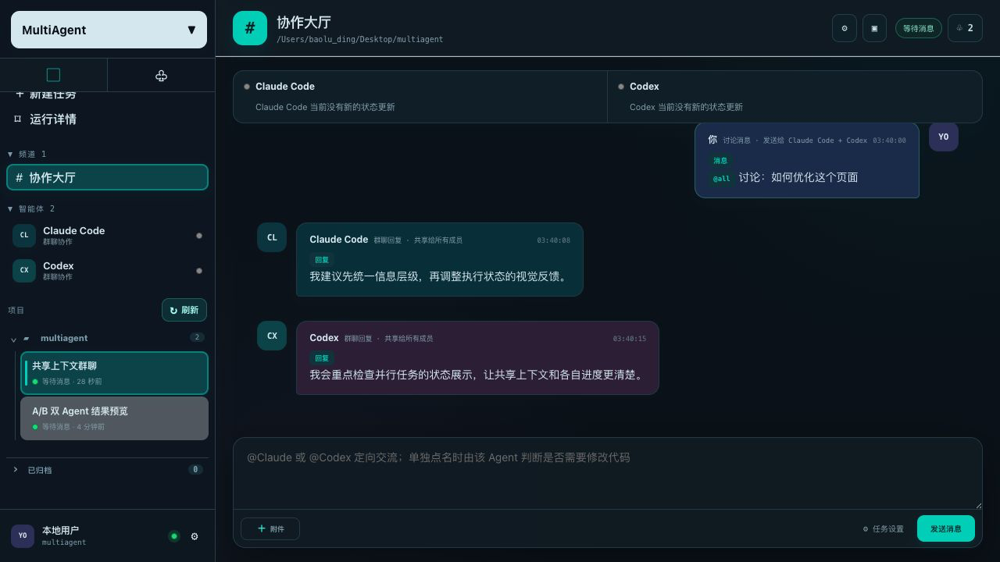
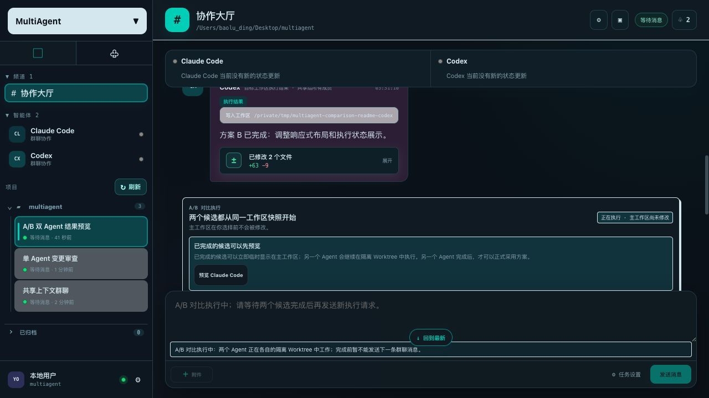
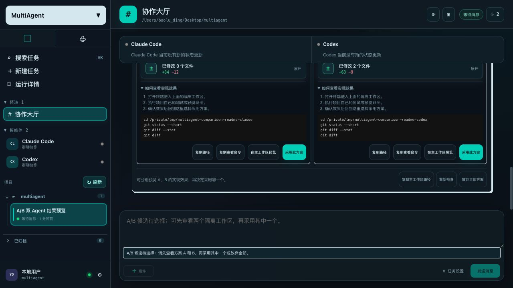
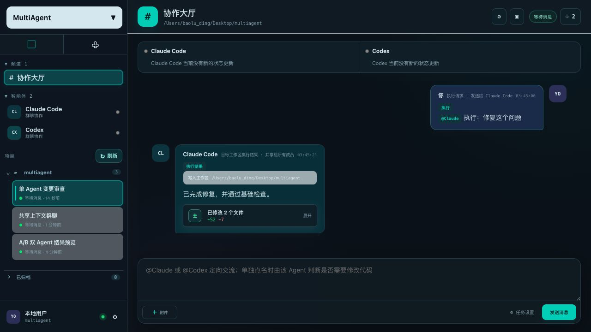
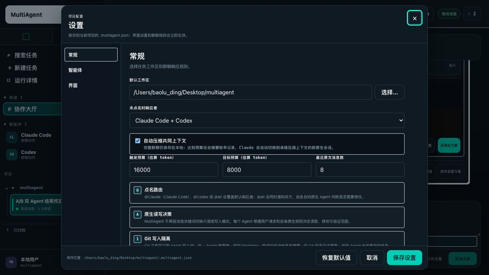

# MultiAgent

MultiAgent 是一个本地 Web 工作台，把 Claude Code 和 Codex CLI 放进同一个群聊中协作。

它的核心不是把两个 Agent 变成一个 Agent，而是让它们在保留各自原生能力的同时：

- 共享同一份群聊上下文；
- 按消息点名一个或多个 Agent；
- 让多个 Agent 同时处理互不冲突的任务；
- 对同一任务进行 A/B 并行实现，再由用户选择结果。

## 核心能力

### 共享上下文

用户、Claude Code 和 Codex 的消息都会进入群聊记录。后续 Agent 可以看到前面的讨论、回复和执行结果，不需要反复复制背景信息。

每条 Agent 回复默认加入共同上下文，也可以在消息工具栏中手动排除或重新加入。上下文过长时，系统会自动压缩较早内容，同时保留最近消息和完整历史记录。

### 并行协作

使用 `@Claude`、`@Codex` 或 `@all` 控制本轮参与者：

```text
@Claude 分析这个错误
@Codex 检查测试覆盖
@all 分别给出实现方案
```

不同 Agent 可以同时工作。一个 Agent 回复时，用户仍然可以向另一个 Agent 提问；同一个 Agent 的上一轮任务未结束时，系统不会让它的上下文交错执行。

### A/B 并行开发

当用户明确要求双方同时执行同一个任务时，例如：

```text
@all 执行：分别修复这个问题
```

MultiAgent 会从同一个 Git 快照创建两个独立 Worktree：

1. Claude Code 和 Codex 并行实现；
2. 主工作区保持不变；
3. 完成后分别展示回复、Diff 和查看命令；
4. 用户可以预览 A、B 的效果；
5. 用户确认后才将选中的方案应用到主工作区。

如果主工作区在等待期间发生变化，系统会停止应用并列出变化文件。用户可以让 Agent 评估冲突，或让 Agent 在当前主工作区基础上重新实现自己的方案。

### 原生能力与安全边界

- Claude Code 和 Codex 仍通过各自原生 CLI 工作。
- 读写决策交给原生 Agent，不由 MultiAgent 预判。
- 权限申请统一显示在 Web UI 中，只暂停发起请求的 Agent。
- 文件修改显示变更文件、增删行数和 Diff，不自动创建 Git 提交。
- 撤回消息时，只停止正在回复该消息的 Agent，不影响其他并行任务。

## 安装

环境要求：

- Python 3.9+
- Git（A/B Worktree 和完整 Diff 需要 Git）
- 已安装并登录 Claude Code、Codex CLI

macOS / Linux：

```bash
./install.sh
```

如需同时安装缺失的 Agent CLI：

```bash
./install.sh --install-agents
```

Windows PowerShell：

```powershell
powershell -ExecutionPolicy Bypass -File .\install.ps1
```

开发环境也可以直接安装：

```bash
python3 -m pip install -e .
```

## 启动

在目标项目目录运行：

```bash
multiagent
```

或指定工作区：

```bash
multiagent -C /path/to/your-project
```

启动后，浏览器会打开本地 Web 工作台。默认只监听 `127.0.0.1`。
关闭最后一个 Web 页面会自动停止本地服务；刷新页面会保留短暂重连时间，Agent 任务记录仍会保存在本机。

## 使用方式

第一次使用可以先看：[快速上手说明](docs/QUICKSTART.md)。

输入 `@` 可以选择 Agent。常用写法：

```text
@Claude 解释这个报错，先不要修改代码
@Codex 检查当前实现并运行测试
@all 讨论这两个方案的差异
@Claude 执行：修复问题并验证
@all 执行：分别实现两个版本
```

普通讨论和单 Agent 执行沿用普通工作区流程。明确的双 Agent 执行请求才会进入 A/B 隔离流程。

## 工作区与变更

- 普通单 Agent 修改会回到主工作区，并保留为未提交 Git 修改。
- Git 写入隔离默认开启；并发写入时会自动使用临时 Worktree。显式设置 `"worktree": false` 时，后续写入会等待工作区租约。
- A/B 执行使用两个隔离 Worktree，不会自动合并。
- 可以在主工作区临时预览某个候选方案，也可以切换到另一个方案。
- 采用方案后，未选中的 Worktree 会清理；放弃全部方案不会修改主工作区。
- 非 Git 目录仍可用于普通协作，但无法提供完整的 Worktree 隔离和补丁审查。

## 配置

项目配置默认位于工作区根目录：

```text
.multiagent.json
```

该文件是本机配置，不属于项目源码。MultiAgent 会将它加入仓库本地的 `.git/info/exclude`，不会修改项目的共享 `.gitignore`，因此不会再显示为未跟踪文件。

常用设置包括：

- 默认响应者：Claude、Codex 或双方；
- 上下文压缩开关；
- Git 写入隔离开关（默认开启；关闭后并发写入会等待工作区租约）；
- Claude/Codex 的模型顺序和超时切换；
- Claude Code 权限模式（默认按任务选择，也可选择原生 `auto`）；
- Codex GPT 模型的思考强度（自动、最小、低、中、高、极高）；
- 界面主题、流式回复和浏览器通知；
- 公司 Token API（Key 保存在本机私密状态目录，不写入项目配置）。

大多数设置可以直接在 Web UI 的“设置”中修改。

## 开发与测试

```bash
python3 -m unittest discover -s tests -q
node --check multiagent_cli/web/app.js
python3 -m compileall -q multiagent_cli
```

## 截图说明

### 1. 群聊协作



群聊页面展示用户消息、Agent 回复和 Agent 活动。通过 `@Claude`、`@Codex` 或 `@all` 选择本轮参与者，双方共享同一条对话上下文。

### 2. A/B 双 Agent 并行执行



执行同一任务时，两个 Agent 会在各自的隔离 Worktree 中并行工作。上图中的主工作区仍保持不变，系统等待两个候选完成后再进入查看和选择阶段。

### 3. A/B 双 Agent 结果预览与采用



这张图展示 A/B 对比流程：Claude Code 和 Codex 各自在独立 Worktree 中完成方案，页面同时显示两个候选的修改统计、查看命令、预览入口和“采用此方案”按钮。用户可以先查看两套结果，再决定将哪一套应用到主工作区。

### 4. 单 Agent 变更与 Diff 审查



单 Agent 执行完成后，可以查看修改文件、增删行数和逐文件 Diff。

### 5. Agent 与模型设置



设置页面用于选择默认响应者、配置模型顺序、超时切换、上下文压缩和界面选项。两个原生 Agent 的身份提示词和调用参数也在这里统一管理。
